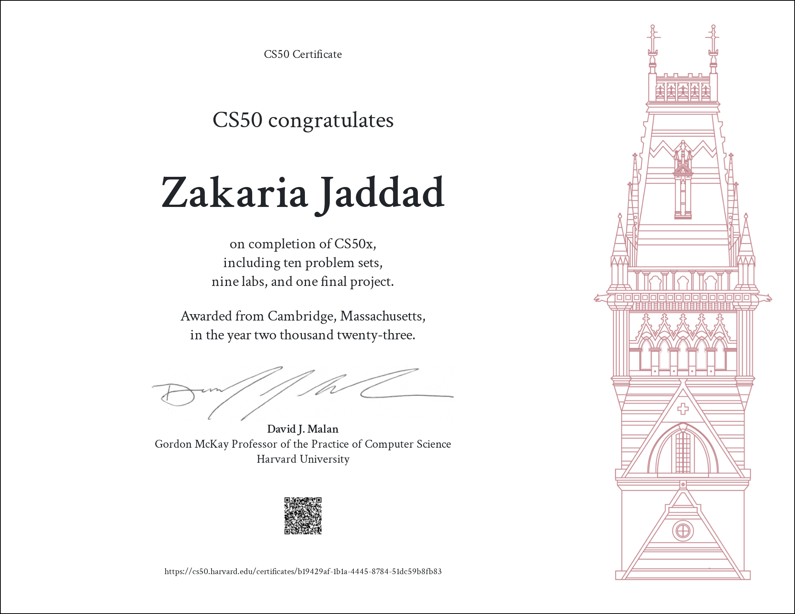

# What is CS50x

CS50x is the online version of Harvard University's introductory computer science course, CS50.

It's designed for beginners with no prior programming experience and covers fundamental concepts of computer science and programming.

The course is taught by Professor David J. Malan and includes topics like algorithms, data structures, software engineering, and web development.

CS50x is free to access, offers problem sets, quizzes, and projects, and provides the option to earn a certificate by completing the course. 

The course uses languages such as C, Python, and JavaScript to teach these concepts.

